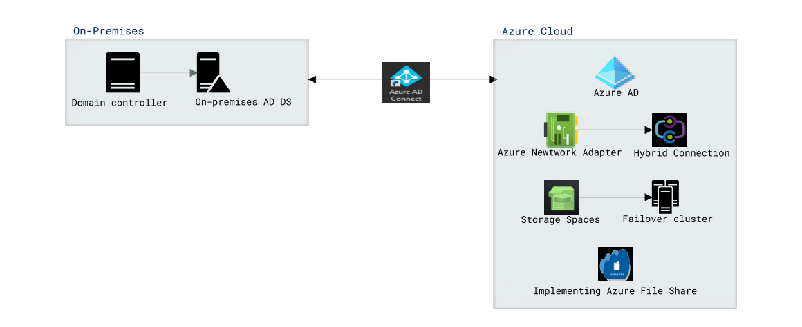

# Lab Scenario Preview: AZ-800-Administering-Windows-Server-Hybrid-Core-Infrastructure

### Lab overview

In this lab, you will learn the core concepts and functionalities related to administering Windows Server in a hybrid environment and how to integrate on-premises and cloud environments. 

## Objectives
  
After completing this lab, you will be able to:

-Deploy and manage Active Directory Domain Services (AD DS) in on-premises and cloud environments
-Manage Windows Servers and workloads in a hybrid environment
-Implement and manage an on-premises and hybrid networking infrastructure
-Manage storage and file services.

## Architecture Diagram

      

