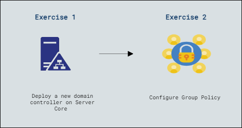

# Lab Scenario Preview: AZ-800-Administering-Windows-Server-Hybrid-Core-Infrastructure

### Lab overview

In this lab, you'll gain hands-on experience setting up Active Directory, managing user access through groups, and configuring Group Policy Objects (GPOs) to control user and computer settings for a comprehensive understanding of identity services and policy management.

## Lab Objectives
  
After completing this lab, you will be able to:

- Deploy a new domain controller on Server Core.
- Configure Group Policy.

## Architecture Diagram

     

   
   >**Note**: Once you understand the lab's content, you can start the Hands-on Lab by clicking the **Launch** button located at the top right corner which leads you to the lab environment and lab guide interface . You can also have a detailed preview of the full lab guide [here](https://experience.cloudlabs.ai/#/labguidepreview/9dd38f15-fde8-4722-b3b8-165adaf502dc), prior to launching your environment.

