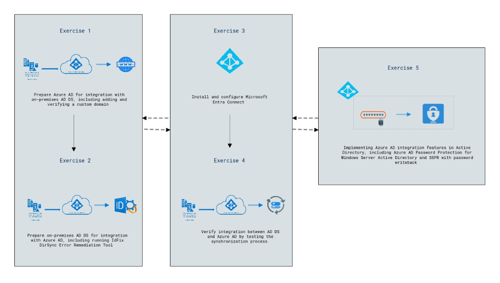

# Lab 2: Implementing integration between AD DS and Azure AD

### Lab overview

In this lab, participants will gain hands-on experience preparing Azure AD and on-premises AD DS for integration, including domain setup, error remediation, and configuration of Azure AD Connect. They'll verify successful synchronization and implement advanced Azure AD integration features like Password Protection for Windows Server AD and Self-Service Password Reset (SSPR) with password writeback to enhance security and user management capabilities.

## Lab objectives

After completing this lab, you will be able to:

- Exercise 1: Prepare Azure AD for integration with on-premises AD DS, including adding and verifying a custom domain.
- Exercise 2: Prepare on-premises AD DS for integration with Azure AD, including running IdFix DirSync Error Remediation Tool.
- Exercise 3: Install and configure Microsoft Entra Connect.
- Exercise 4: Verify integration between AD DS and Azure AD by testing the synchronization process.
- Exercise 5: Implementing Azure AD integration features in Active Directory, including Azure AD Password Protection for Windows Server Active Directory and SSPR with password writeback.

## Architecture Diagram

     

   >**Note**: Once you understand the lab's content, you can start the Hands-on Lab by clicking the **Launch** button located at the top right corner which leads you to the lab environment and lab guide interface . You can also have a detailed preview of the full lab guide [here](https://experience.cloudlabs.ai/#/labguidepreview/74e08b6f-8e49-47fe-904b-a093f96ef2b0), prior to launching your environment.

