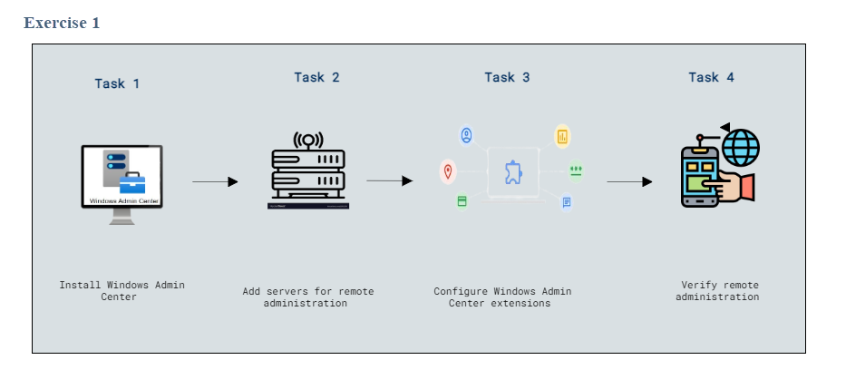

# Lab Scenario Preview: Lab 3: Managing Windows Server

### Lab overview

 In this lab, you'll learn to install and set up Windows Admin Center, add and manage servers for remote administration, configure extensions to enhance functionality, and effectively administer servers through Remote PowerShell, ensuring streamlined centralized management and monitoring of the infrastructure.

## Lab Objectives
  
After completing this lab, you will be able to:

  - Task 1: Install Windows Admin Center
  - Task 2: Add servers for remote administration
  - Task 3: Configure Windows Admin Center extensions
  - Task 4: Verify remote administration
  - Task 5:Administer servers with Remote PowerShell

## Architecture Diagram

     

   >**Note**: Once you understand the lab's content, you can start the Hands-on Lab by clicking the **Launch** button located at the top right corner which leads you to the lab environment and lab guide interface . You can also have a detailed preview of the full lab guide [here](https://experience.cloudlabs.ai/#/labguidepreview/d6f7246a-9f71-487e-a474-48e076a301b1), prior to launching your environment.

