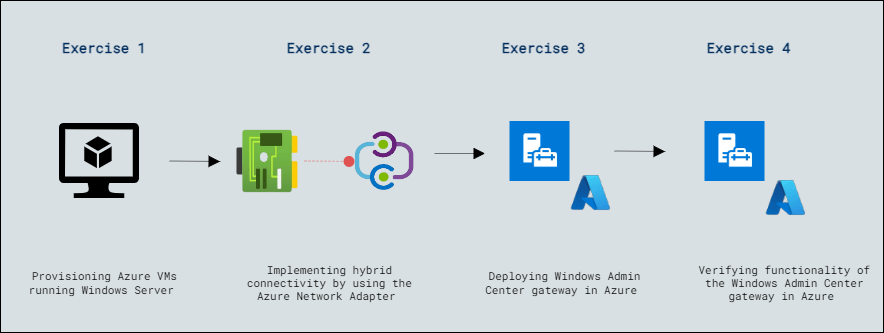

# Lab Scenario Preview: Lab 4: Using Windows Admin Center in hybrid scenarios

### Lab overview

In this lab, participants will explore Windows Admin Center's utilization in hybrid environments, focusing on provisioning Azure VMs with Windows Server, establishing hybrid connectivity via Azure Network Adapter, deploying a Windows Admin Center gateway in Azure, and validating its functionality for streamlined management across on-premises and cloud-based resources.

## Lab Objectives
  
After completing this lab, you will be able to:

- Exercise 1:  Provisioning Azure VMs running Windows Server
- Exercise 2: Implementing hybrid connectivity by using the Azure Network Adapter
- Exercise 3: Deploying Windows Admin Center gateway in Azure
- Exercise 4: Verifying functionality of the Windows Admin Center gateway in Azure

## Architecture Diagram

     

   
   >**Note**: Once you understand the lab's content, you can start the Hands-on Lab by clicking the **Launch** button located at the top right corner which leads you to the lab environment and lab guide interface . You can also have a detailed preview of the full lab guide [here](https://experience.cloudlabs.ai/#/labguidepreview/db311aa6-a1fb-4702-af4b-5b0d0eaed2fa), prior to launching your environment.

