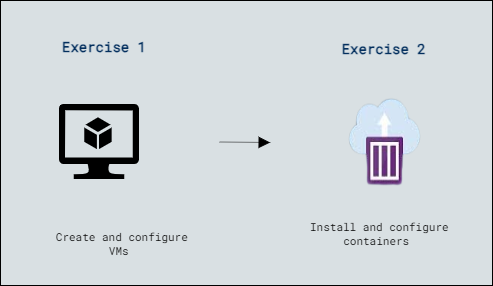

# Lab Scenario Preview: Lab 5: Implementing and configuring virtualization in Windows Server

### Lab overview

In this lab, participants will learn to set up virtualization in Windows Server by creating Hyper-V virtual switches, virtual hard disks, and virtual machines. Additionally, they will explore Windows Admin Center for managing both virtual machines and containers, including the installation of Docker on Windows Server and running Windows containers for streamlined containerized application management.

## Lab Objectives
  
After completing this lab, you will be able to:

- Exercise 1: Create and configure VMs.
- Exercise 2: Install and configure containers.

## Architecture Diagram

     

   >**Note**: Once you understand the lab's content, you can start the Hands-on Lab by clicking the **Launch** button located at the top right corner which leads you to the lab environment and lab guide interface . You can also have a detailed preview of the full lab guide [here](https://experience.cloudlabs.ai/#/labguidepreview/b0764ea6-3895-4623-8315-61cdae81e26c), prior to launching your environment.

