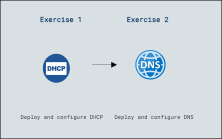

# Lab Scenario Preview: Lab 7: Implementing and configuring network infrastructure services in Windows Server

### Lab overview

In this lab, you'll gain expertise in deploying DHCP and DNS services on Windows Server by setting up and authorizing DHCP servers, creating scopes, configuring DHCP Failover for redundancy, installing DNS roles, implementing forwarding and conditional forwarding, configuring DNS policies, and verifying their functionality, ensuring efficient IP address management and DNS resolution within the network infrastructure.

## Lab Objectives
  
After completing this lab, you will be able to:

- Exercise 1: Deploy and configure DHCP.
- Exercise 2: Deploy and configure DNS.

## Architecture Diagram

     

   

   >**Note**: Once you understand the lab's content, you can start the Hands-on Lab by clicking the **Launch** button located at the top right corner which leads you to the lab environment and lab guide interface . You can also have a detailed preview of the full lab guide [here](https://experience.cloudlabs.ai/#/labguidepreview/98bb8717-1931-4a55-998a-73c8b10583f5), prior to launching your environment.

