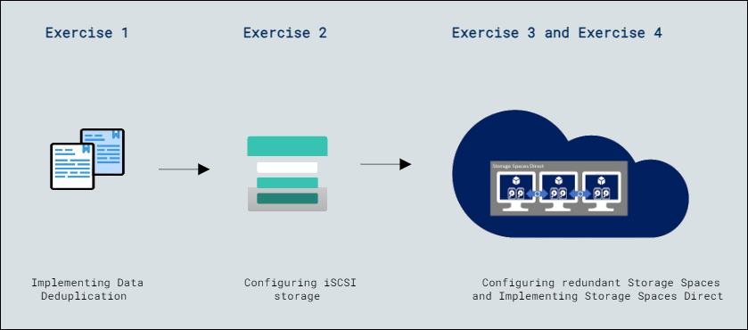

# Lab Scenario Preview:Lab 9: Implementing storage solutions in Windows Server

### Lab overview

In this lab, participants will explore storage solutions in Windows Server by testing Data Deduplication implementation, setting up and configuring iSCSI storage, establishing redundant Storage Spaces, and validating the implementation of Storage Spaces Direct, gaining practical knowledge in optimizing storage, enabling efficient data deduplication, and setting up resilient storage solutions.

## Lab Objectives
  
After completing this lab, you will be able to:

- Exercise 1: Implement Data Deduplication.
- Exercise 2: Configure iSCSI storage.
- Exercise 3: Configure Storage Spaces.
- Exercise 4: Implement Storage Spaces Direct.

## Architecture Diagram

     
   

   >**Note**: Once you understand the lab's content, you can start the Hands-on Lab by clicking the **Launch** button located at the top right corner which leads you to the lab environment and lab guide interface . You can also have a detailed preview of the full lab guide [here](https://experience.cloudlabs.ai/#/labguidepreview/1e0ee68c-e186-4e61-8c7e-08d809e3a306), prior to launching your environment.

