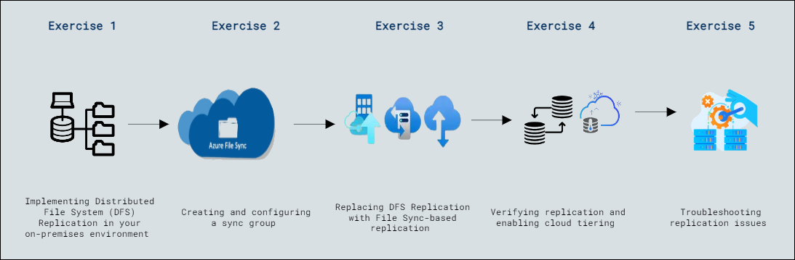

# Lab Scenario Preview: Lab 10: Implementing Azure File Sync

### Lab overview

In this lab, participants will practice deploying DFS deployments, utilizing Azure file shares, setting up Storage Sync Service with File Sync groups, registering server endpoints, enabling cloud tiering, and monitoring replication, providing hands-on experience in Azure File Sync for synchronization, conflict resolution, and efficient file management across distributed servers.

## Lab Objectives
  
After completing this lab, you will be able to:

- Exercise 1: Implementing Distributed File System (DFS) Replication in your on-premises environment
- Exercise 2: Creating and configuring a sync group
- Exercise 3: Replacing DFS Replication with File Sync-based replication
- Exercise 4: Verifying replication and enabling cloud tiering
- Exercise 5: Troubleshooting replication issues

## Architecture Diagram

     

   
   >**Note**: Once you understand the lab's content, you can start the Hands-on Lab by clicking the **Launch** button located at the top right corner which leads you to the lab environment and lab guide interface . You can also have a detailed preview of the full lab guide [here](https://experience.cloudlabs.ai/#/labguidepreview/36991240-5139-4ecb-8088-00dea6601b84), prior to launching your environment.

